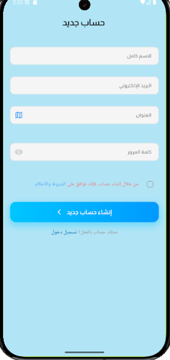
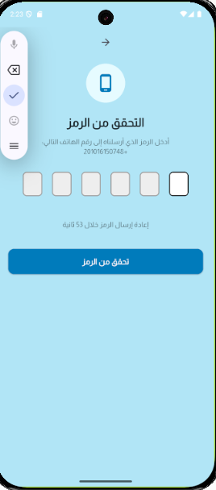
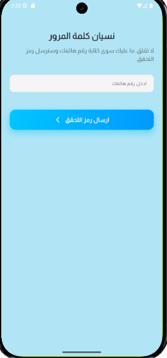
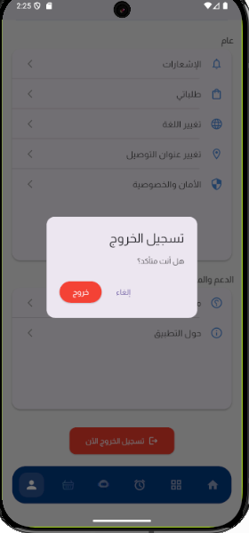
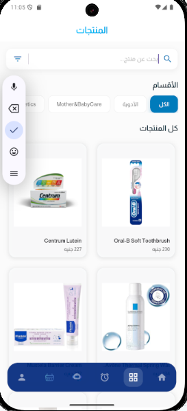
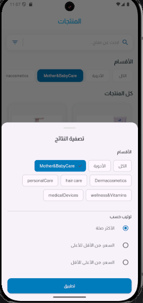
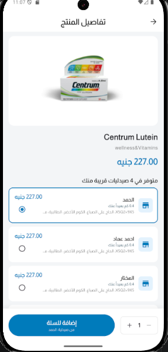
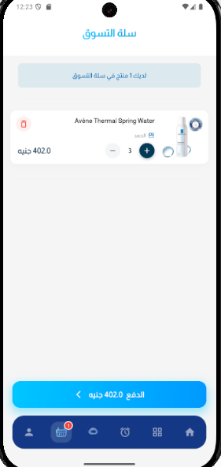
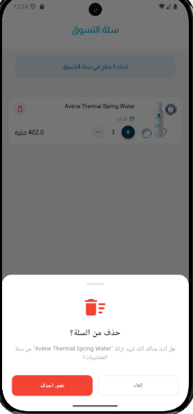

# 💊 PharmaGo

A Smart Pharmacy Management & Healthcare Ecosystem built with **Flutter** and **Firebase**, following **Clean Architecture**, **Repository Pattern**, **SOLID Principles**, and **Cubit (flutter_bloc)**.

---

# 🚀 Tech Stack

- Flutter
- Dart
- Firebase Authentication
- Cloud Firestore
- Firebase Storage
- SharedPreferences
- flutter_bloc (Cubit)
- GetIt (Dependency Injection)
- Dartz (Either)
- Clean Architecture
- Repository Pattern

---

# ✨ Features

## 🔐 Authentication

- Email & Password Authentication
- Google Sign-In
- Phone OTP Verification
- Password Reset
- Email Verification
- Delete Account with Re-authentication

---

## 🛍 Products

- Display Products
- Product Details
- Real-time Best Selling Products
- Search by Name
- Search by Product Code
- Category Filtering
- Discount Filtering
- Price Sorting
- Firestore Integration

---

## 📱 Screenshots

### Authentication

<table>
<tr>
<td align="center">
<br/>
Login
</td>

<td align="center">
<br/>
Signup
</td>

<td align="center">
<br/>
OTP Verification
</td>

<td align="center">
<br/>
Forgot Password
</td>

</tr>

<tr>

<td align="center">
<br/>
Profile
</td>

<td align="center">
<br/>
Logout
</td>

<td></td>
<td></td>

</tr>

</table>

---

### Products

<table>

<tr>

<td align="center">
<br/>
Products
</td>

<td align="center">
<br/>
Search & Filtering
</td>

<td align="center">
<br/>
Product Details
</td>

</tr>

</table>

---

# 🏛 Architecture

The project follows **Clean Architecture** to separate business logic from presentation and data access.

```
Presentation
│
├── Cubit
│
Domain
│
├── Entity
├── Repository
└── UseCases
│
Data
│
├── Repository Implementation
├── Remote DataSource
├── Local DataSource
└── Models
```

---

# 🔐 Authentication Feature

```
lib/featchers/auth/
├── data/
│   ├── datasources/
│   │   ├── local/
│   │   └── remote/
│   ├── models/
│   └── repositories/
├── domain/
│   ├── entites/
│   ├── repositories/
│   └── usecases/
└── presentation/
    ├── cubits/
    └── view/
```

## Responsibilities

### RemoteDataSource

- Firebase Authentication
- Google Sign-In
- Phone Authentication
- Password Reset
- Email Verification

### LocalDataSource

- Cache User
- Read Cached User
- Clear Cache

### Repository

- Coordinates Remote + Local + Firestore
- Converts Exceptions to Failures
- Converts Models to Entities

### UseCases

Each business action has its own UseCase.

Examples:

- LoginUseCase
- SignupUseCase
- LogoutUseCase
- GoogleLoginUseCase
- VerifyPhoneUseCase
- VerifyOtpUseCase
- ResetPasswordUseCase
- DeleteAccountUseCase
- GetCurrentUserUseCase
- CheckEmailExistsUseCase
- SendEmailVerificationUseCase

### Cubits

Cubits depend only on **UseCases**.

---

## Authentication Flow

```
LoginView

↓

LoginCubit

↓

LoginUseCase

↓

AuthRepository

↓

AuthRemoteDataSource
      │
      ├── Firebase Authentication
      ├── Firestore
      └── Local Cache
```

---

# 🛍 Products Feature

```
lib/Features/products/
├── data/
│   ├── datasource/
│   │   ├── remote/
│   │   └── local/
│   ├── model/
│   └── repositories/
├── domain/
│   ├── entityes/
│   ├── repositories/
│   └── usecases/
└── presentation/
    ├── cubit/
    ├── view/
    └── widgets/
```

## Responsibilities

### RemoteDataSource

- Reads Products from Firestore
- Streams Best Selling Products

### Repository

- Converts ProductModel → ProductEntity
- Handles Either & Failures

### UseCases

- GetProductsUseCase
- GetBestSellingProductsUseCase

### ProductsCubit

Responsible for:

- Loading Products
- Loading Best Selling Products
- Search
- Category Filtering
- Discount Filtering
- Price Sorting

---

## Products Flow

```
ProductsView

↓

ProductsCubit

↓

GetProductsUseCase

↓

ProductsRepository

↓

ProductsRemoteDataSource

↓

DatabaseService

↓

Cloud Firestore
```

---

# 🧩 Dependency Injection

The project uses **GetIt**.

Registration order:

1. Core Services
2. DataSources
3. Repositories
4. UseCases
5. Cubits

---

# ⚠ BlocProvider vs BlocProvider.value

Singleton Cubits should always use:

```dart
BlocProvider.value(
  value: getIt<LoginCubit>(),
)
```

Factory Cubits should use:

```dart
BlocProvider(
  create: (_) => getIt<SugnupCubit>(),
)
```

This prevents the runtime error:

```
StateError:
Cannot emit new states after calling close
```

---

# 📈 Future Improvements

- Offline Cache (Hive)
- Pagination
- Infinite Scrolling
- Server-side Search
- Server-side Filtering

---

# 📂 Project Structure

```
lib/
│
├── core/
├── Features/
│
├── auth/
├── products/
├── cart/
├── orders/
├── profile/
│
└── main.dart
```

## 🛒 Cart

- Add Products to Cart
- Update Product Quantity
- Remove Items from Cart
- Clear Cart
- Persistent Cart using SharedPreferences
- Prescription Support
- Local Cart Storage
- Clean Architecture
- UseCases + Cubit

---

### Cart

<table>

<tr>

<td align="center">
<br/>
Cart
</td>

<td align="center">
<br/>
Delete Item
</td>

</tr>

</table>

---

# 🛒 Cart Feature

```text
lib/Features/cart/
├── data/
│   ├── datasource/
│   │   └── local/
│   ├── models/
│   └── repositories/
├── domain/
│   ├── entities/
│   ├── repositories/
│   └── usecases/
└── presentation/
    ├── cubits/
    ├── view/
    └── widgets/
```

## Responsibilities

### LocalDataSource

- Save Cart
- Read Cart
- Clear Cart
- SharedPreferences Storage

### Repository

- Handles Local Storage
- Converts Models ↔ Entities
- Provides Cart Operations

### UseCases

- AddProductToCartUseCase
- UpdateQuantityUseCase
- DeleteCartItemUseCase
- GetCartUseCase
- SaveCartUseCase
- ClearCartUseCase

### CartCubit

Responsible for:

- Add Product
- Remove Product
- Update Quantity
- Load Saved Cart
- Save Cart Automatically
- Clear Cart
- Handle Prescription Image

---

## Cart Flow

```text
CartView

↓

CartCubit

↓

UseCases

↓

CartRepository

↓

CartLocalDataSource

↓

SharedPreferences
```

---

## Cart Persistence

The shopping cart is stored locally using **SharedPreferences**, allowing users to keep their cart contents even after restarting the application.

Current implementation:

- Per-user cart persistence
- Automatic cart restoration
- Automatic save after every update
- Local storage only (offline)

Future improvement:

- Synchronize cart with Firestore after user authentication for multi-device support.

---

# 👨‍💻 Author

**Ahmed Emad**

Flutter Developer

- GitHub: https://github.com/ahmedemad755
- LinkedIn: https://www.linkedin.com/in/ahmed-emad-flutter/
- 
